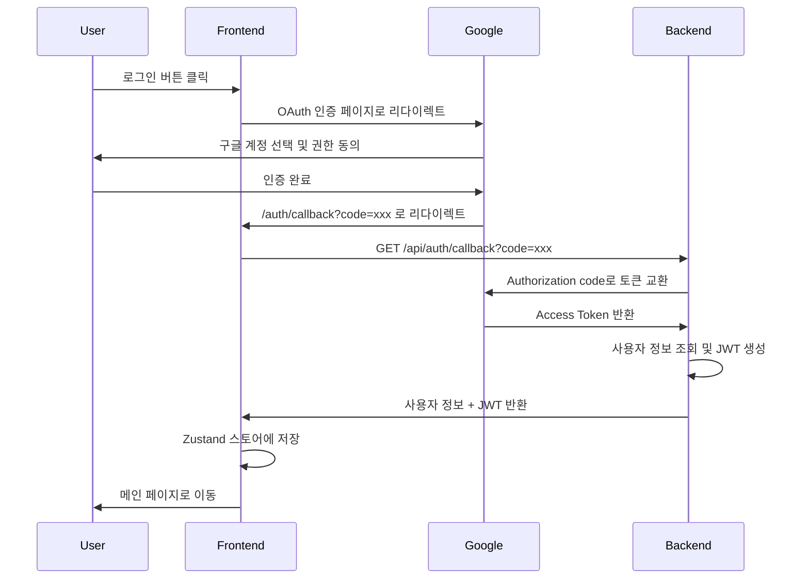

# Google OAuth 로그인 구현 가이드

## 🚀 구현 완료 항목

### 1. Zustand 기반 인증 스토어
- **파일**: `src/store/authStore.ts`
- **기능**: 사용자 정보 및 로그인 상태를 전역으로 관리
- **특징**: localStorage에 자동 저장되어 새로고침 시에도 로그인 상태 유지

### 2. Google OAuth API 함수
- **파일**: `src/api/auth.ts`
- **함수**:
  - `startGoogleLogin()`: Google OAuth 로그인 페이지로 리다이렉트
  - `handleGoogleCallback(code)`: Authorization code를 백엔드로 전달하여 JWT 획득
  - `logout()`: 로그아웃 처리

### 3. AuthCallback 페이지
- **파일**: `src/pages/AuthCallback.tsx`, `src/pages/AuthCallback.css`
- **기능**: Google에서 리다이렉트된 후 authorization code를 처리
- **UI**: 로딩, 성공, 실패 상태에 따른 애니메이션 제공

### 4. 타입 정의
- **파일**: `src/types/auth.ts`
- **타입**: `User`, `AuthResponse`, `AuthError`

### 5. 기존 컴포넌트 업데이트
- **Login.tsx**: Google 로그인 버튼 클릭 시 `startGoogleLogin()` 호출
- **App.tsx**: 인증 스토어 연동 및 callback 라우팅 처리
- **AccountPanel.tsx**: 로그아웃 버튼 추가

---

## ⚙️ 환경변수 설정

프로젝트 루트의 `Frontend/` 폴더에 `.env` 파일을 생성하고 다음 내용을 추가하세요:

```env
VITE_API_BASE_URL=https://sketchcheck.shop
VITE_GOOGLE_CLIENT_ID=133050396922-856c4qtiu21ta4h3s9j2tbua02kk1c23.apps.googleusercontent.com
VITE_GOOGLE_REDIRECT_URI=https://sketchcheck.shop/auth/callback
```

### 환경변수 설명
- `VITE_API_BASE_URL`: 백엔드 API 서버 주소
- `VITE_GOOGLE_CLIENT_ID`: Google OAuth Client ID
- `VITE_GOOGLE_REDIRECT_URI`: OAuth callback redirect URI

> **참고**: `.env.example` 파일을 복사하여 시작할 수 있습니다.

---

## 🔄 Google OAuth 로그인 플로우



---

## 📁 프로젝트 구조

```
Frontend/
├── src/
│   ├── api/
│   │   └── auth.ts              # Google OAuth API 함수
│   ├── store/
│   │   └── authStore.ts         # Zustand 인증 스토어
│   ├── types/
│   │   └── auth.ts              # 인증 관련 타입 정의
│   ├── pages/
│   │   ├── Login.tsx            # 로그인 페이지 (Google 로그인 버튼)
│   │   ├── AuthCallback.tsx     # OAuth callback 처리 페이지
│   │   └── AuthCallback.css
│   ├── components/
│   │   ├── AccountPanel.tsx     # 계정 패널 (로그아웃 버튼 포함)
│   │   └── AccountPanel.css
│   └── App.tsx                  # 메인 앱 (인증 상태 관리)
├── .env                         # 환경변수 (직접 생성 필요)
└── .env.example                 # 환경변수 예제
```

---

## 🧪 테스트 방법

### 1. 개발 서버 실행
```bash
cd Frontend
npm install
npm run dev
```

### 2. 로그인 테스트
1. 브라우저에서 `http://localhost:5173` 접속
2. "Continue with Google" 버튼 클릭
3. Google 계정 선택 및 권한 동의
4. 자동으로 메인 페이지로 리다이렉트 확인
5. 우측 상단 프로필 아이콘 클릭하여 계정 정보 확인

### 3. 로그아웃 테스트
1. 프로필 아이콘 클릭하여 AccountPanel 열기
2. "Log Out" 버튼 클릭
3. 로그인 페이지로 이동 확인

### 4. 새로고침 테스트
1. 로그인 상태에서 페이지 새로고침
2. 로그인 상태가 유지되는지 확인 (localStorage에 저장됨)

---

## 🔒 보안 고려사항

1. **JWT 토큰 저장**: 현재는 Zustand의 localStorage에 사용자 정보만 저장하고, JWT는 백엔드에서 쿠키로 전달하도록 설정 (`withCredentials: true`)
2. **HTTPS 필수**: 프로덕션 환경에서는 반드시 HTTPS를 사용해야 합니다.
3. **환경변수 보안**: `.env` 파일은 절대 Git에 커밋하지 마세요 (이미 `.gitignore`에 포함됨)

---

## 🐛 트러블슈팅

### 문제: "Google Client ID가 설정되지 않았습니다" 에러
**해결**: `.env` 파일이 제대로 생성되었는지 확인하세요.

### 문제: Callback 페이지에서 에러 발생
**해결**: 
1. 백엔드 서버가 정상 작동하는지 확인
2. Google Cloud Console에서 redirect_uri가 올바르게 설정되었는지 확인
3. 네트워크 탭에서 `/api/auth/callback` 요청의 응답 확인

### 문제: 로그인 상태가 유지되지 않음
**해결**: 브라우저 개발자 도구에서 localStorage를 확인하고, `auth-storage` 키가 있는지 확인

---

## 📝 백엔드 요구사항

백엔드에서 다음 API를 제공해야 합니다:

### 1. `GET /api/auth/callback`
- **파라미터**: `code` (Google authorization code)
- **응답**:
```json
{
  "user": {
    "id": "user-id",
    "email": "user@example.com",
    "name": "User Name",
    "picture": "https://..."
  },
  "token": "jwt-token" // 또는 쿠키로 전달
}
```

### 2. `POST /api/auth/logout` (선택사항)
- **설명**: 세션 무효화 또는 쿠키 삭제
- **응답**: 성공 메시지

---

## 🎉 완료!

이제 Google OAuth 로그인 기능이 완전히 구현되었습니다. 문제가 있으면 위의 트러블슈팅 섹션을 참고하거나, 개발자 도구의 콘솔과 네트워크 탭을 확인하세요.

